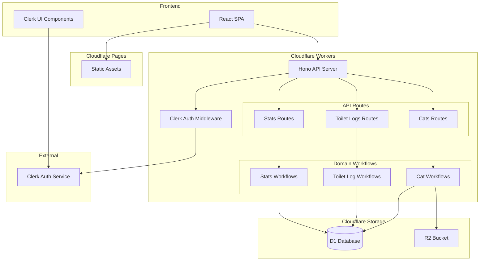
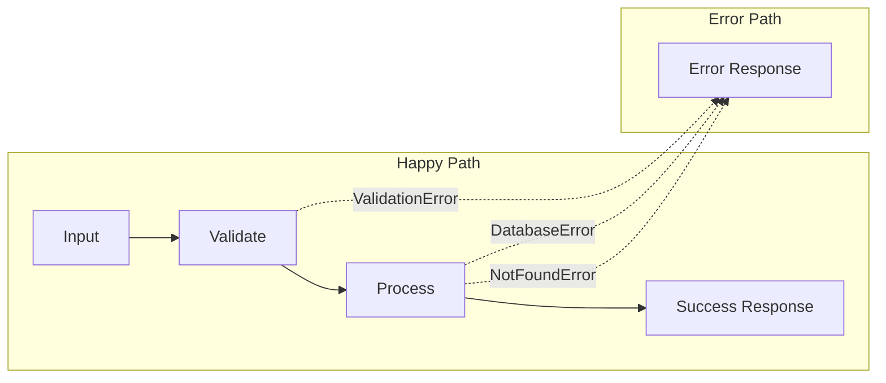
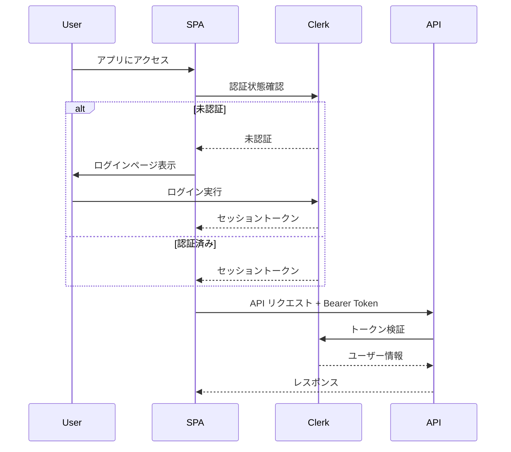
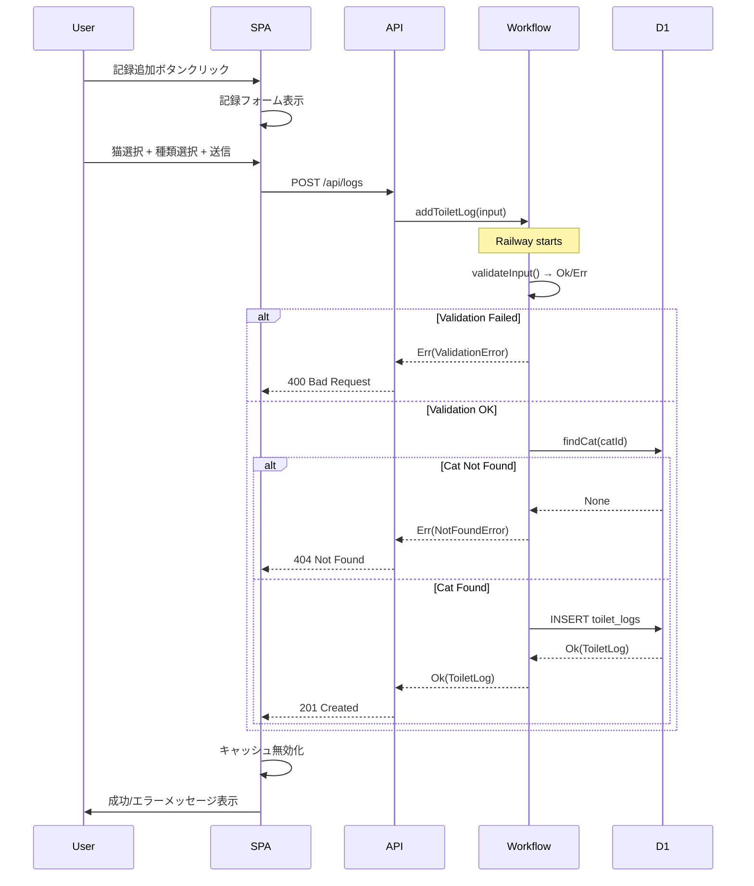
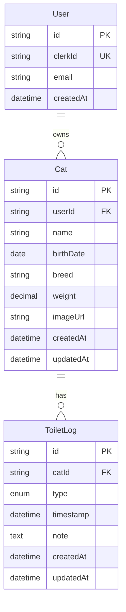

# Technical Design Document

## Overview

**Purpose**: NekoLog は飼い猫のトイレ利用状況を記録・可視化し、飼い主が猫の健康状態を把握できるようにする Web アプリケーションです。

**Users**: 猫の飼い主が日常的にトイレ記録を登録し、ダッシュボードで統計を確認するために使用します。

**Impact**: Cloudflare エコシステム上にサーバーレスアプリケーションとして新規構築します。

### Goals
- 猫のトイレ記録を素早く登録できる UI
- 日別・週別・月別の統計をダッシュボードで可視化
- 複数の猫を管理可能
- 招待制認証による安全なアクセス制御
- Hono RPC による型安全なスキーマ駆動 API
- **neverthrow による Railway Oriented Programming で型安全なエラーハンドリング**
- pnpm + Turborepo によるモノレポ構成
- GitHub Actions による自動 CI/CD

### Non-Goals
- ユーザー自己登録機能（管理者による事前登録のみ）
- ご飯・カロリー計算機能（将来対応）
- 健康アラート・通知機能（将来対応）
- PWA / オフライン同期（初期スコープ外）

## Architecture

### Architecture Pattern & Boundary Map



**Architecture Integration**:
- **Selected Pattern**: レイヤードモノリス（単一 Workers 内で機能別ルート分割）+ ワークフロー駆動
- **Domain Boundaries**: 認証・猫管理・トイレ記録・統計の4ドメイン（requirements.md の Bounded Contexts に対応）
- **Error Handling**: neverthrow による Railway Oriented Programming
- **Steering Compliance**: Cloudflare サーバーレス、TypeScript ファースト、スキーマ駆動

### Technology Stack

| Layer | Choice / Version | Role in Feature | Notes |
|-------|------------------|-----------------|-------|
| Package Manager | pnpm v9 | 依存関係管理 | workspaces でモノレポ |
| Build Orchestration | Turborepo v2 | ビルド・タスク実行 | キャッシュで高速化 |
| Frontend | React 18 + Vite + TypeScript | SPA UI | TanStack Query でデータ取得 |
| API Client | hc (Hono Client) | 型安全 API 呼び出し | AppType から型推論 |
| State Management | TanStack Query v5 | サーバー状態管理 | キャッシュ・再取得自動化 |
| UI Components | Tailwind CSS + shadcn/ui | スタイリング | モバイルファースト |
| Charts | Recharts | 統計グラフ表示 | 軽量チャートライブラリ |
| Backend | Hono v4 + TypeScript | API サーバー | Workers 最適化 |
| Validation | Zod | スキーマ検証 | RPC 型生成に使用 |
| Error Handling | neverthrow | Railway Oriented Programming | Result 型でエラーを型安全に表現 |
| ORM | Drizzle ORM | DB クエリ | D1 ネイティブ対応 |
| Database | Cloudflare D1 | データ永続化 | SQLite 互換 |
| Object Storage | Cloudflare R2 | 画像保存 | 猫の写真用 |
| Authentication | Clerk | 認証・認可 | @hono/clerk-auth |
| Hosting | Cloudflare Pages | 静的ホスティング | SPA 配信 |
| Runtime | Cloudflare Workers | API ホスティング | エッジ実行 |
| CI/CD | GitHub Actions | 自動テスト・デプロイ | wrangler-action v3 |

### Monorepo Structure

```
nekolog/
├── .github/
│   └── workflows/
│       ├── ci.yml              # PR 時のテスト・lint
│       └── deploy.yml          # main マージ時のデプロイ
├── apps/
│   ├── web/                    # React SPA (Cloudflare Pages)
│   │   ├── src/
│   │   ├── package.json
│   │   ├── vite.config.ts
│   │   └── tsconfig.json
│   └── api/                    # Hono API (Cloudflare Workers)
│       ├── src/
│       │   ├── index.ts        # エントリーポイント
│       │   ├── routes/         # API ルート
│       │   ├── workflows/      # ドメインワークフロー
│       │   ├── repositories/   # データアクセス層
│       │   └── middleware/     # ミドルウェア
│       ├── package.json
│       ├── wrangler.toml
│       └── tsconfig.json
├── packages/
│   └── shared/                 # 共有型・スキーマ
│       ├── src/
│       │   ├── types.ts        # 共通型定義
│       │   ├── schemas.ts      # Zod スキーマ
│       │   └── errors.ts       # ドメインエラー定義
│       ├── package.json
│       └── tsconfig.json
├── package.json                # ルート package.json
├── pnpm-workspace.yaml         # pnpm workspaces 設定
├── turbo.json                  # Turborepo 設定
└── tsconfig.base.json          # 共通 TypeScript 設定
```

## Railway Oriented Programming with neverthrow

### Error Handling Philosophy

Domain Modeling Made Functional のアプローチに基づき、エラーを例外ではなく型で表現します。



### Domain Error Types

```typescript
// packages/shared/src/errors.ts
import { err, ok, Result, ResultAsync } from 'neverthrow';

// Discriminated union for domain errors
export type DomainError =
  | { type: 'validation'; field: string; message: string }
  | { type: 'not_found'; resource: string; id: string }
  | { type: 'unauthorized'; message: string }
  | { type: 'confirmation_required' }
  | { type: 'database'; message: string };

// Type-safe error constructors
export const DomainErrors = {
  validation: (field: string, message: string): DomainError =>
    ({ type: 'validation', field, message }),
  notFound: (resource: string, id: string): DomainError =>
    ({ type: 'not_found', resource, id }),
  unauthorized: (message: string): DomainError =>
    ({ type: 'unauthorized', message }),
  confirmationRequired: (): DomainError =>
    ({ type: 'confirmation_required' }),
  database: (message: string): DomainError =>
    ({ type: 'database', message }),
};

// Helper to convert Zod errors to DomainError
export const fromZodError = (error: z.ZodError): DomainError => ({
  type: 'validation',
  field: error.errors[0]?.path.join('.') ?? 'unknown',
  message: error.errors[0]?.message ?? 'Validation failed',
});
```

### Workflow Pattern

各ワークフローは `ResultAsync<T, DomainError>` を返し、`andThen()` でチェーンします。

```typescript
// apps/api/src/workflows/cat-workflows.ts
import { ResultAsync, okAsync, errAsync } from 'neverthrow';
import { DomainError, DomainErrors, fromZodError } from '@nekolog/shared';

// Workflow: RegisterCat
export const registerCat = (
  input: unknown,
  userId: string,
  deps: { catRepo: CatRepository; r2: R2Bucket }
): ResultAsync<Cat, DomainError> => {
  // 1. Validate input
  return validateCatInput(input)
    // 2. Check name uniqueness (optional business rule)
    .andThen((validated) => checkNameUniqueness(validated, userId, deps.catRepo))
    // 3. Upload photo if provided
    .andThen((validated) => uploadPhotoIfProvided(validated, deps.r2))
    // 4. Create cat in database
    .andThen((catData) => deps.catRepo.create(catData, userId));
};

// Each step returns ResultAsync<T, DomainError>
const validateCatInput = (input: unknown): ResultAsync<CreateCatInput, DomainError> => {
  const result = createCatSchema.safeParse(input);
  if (!result.success) {
    return errAsync(fromZodError(result.error));
  }
  return okAsync(result.data);
};
```

### API Route Integration

ルートハンドラで `match()` を使って HTTP レスポンスに変換します。

```typescript
// apps/api/src/routes/cats.ts
import { Hono } from 'hono';
import { registerCat } from '../workflows/cat-workflows';

const catsRoutes = new Hono<{ Bindings: Bindings }>()
  .post('/', async (c) => {
    const userId = c.get('userId');
    const body = await c.req.json();

    const result = await registerCat(body, userId, {
      catRepo: createCatRepository(c.env.DB),
      r2: c.env.BUCKET,
    });

    return result.match(
      (cat) => c.json(cat, 201),
      (error) => handleDomainError(c, error)
    );
  });

// Error to HTTP response mapping
const handleDomainError = (c: Context, error: DomainError): Response => {
  switch (error.type) {
    case 'validation':
      return c.json({ error }, 400);
    case 'not_found':
      return c.json({ error }, 404);
    case 'unauthorized':
      return c.json({ error }, 401);
    case 'confirmation_required':
      return c.json({ error }, 422);
    case 'database':
      return c.json({ error: { type: 'internal', message: 'Server error' } }, 500);
  }
};
```

## System Flows

### 認証フロー



### トイレ記録登録フロー（Railway Oriented）



## Requirements Traceability

| Workflow | Summary | Components | Interfaces | Flows |
|----------|---------|------------|------------|-------|
| WF1 AuthenticateUser | ログイン | LoginPage, ClerkProvider, ClerkMiddleware | - | 認証フロー |
| WF2 TerminateSession | ログアウト | Header, ClerkProvider | - | - |
| WF3 RegisterCat | 猫登録 | CatForm, registerCat workflow | CatsAPI | - |
| WF4 UpdateCat | 猫更新 | CatEditForm, updateCat workflow | CatsAPI | - |
| WF5 DeleteCat | 猫削除 | CatDeleteDialog, deleteCat workflow | CatsAPI | カスケード削除 |
| WF6 ListCats | 猫一覧 | CatList, listCats workflow | CatsAPI | - |
| WF7 AddToiletLog | 記録追加 | LogForm, addToiletLog workflow | LogsAPI | 記録登録フロー |
| WF8 UpdateToiletLog | 記録更新 | LogEditForm, updateToiletLog workflow | LogsAPI | - |
| WF9 DeleteToiletLog | 記録削除 | LogDeleteDialog, deleteToiletLog workflow | LogsAPI | - |
| WF10 GetToiletHistory | 履歴取得 | HistoryList, getHistory workflow | LogsAPI | - |
| WF11 GetDashboardStats | 統計取得 | DashboardPage, getStats workflow | StatsAPI | - |

## Components and Interfaces

### Summary

| Component | Domain/Layer | Intent | Workflow Coverage | Key Dependencies | Contracts |
|-----------|--------------|--------|------------------|------------------|-----------|
| HonoApp | Backend/Core | API エントリーポイント | All | Hono, ClerkMiddleware (P0) | API |
| CatWorkflows | Backend/Workflow | 猫管理ワークフロー | WF3-6 | CatRepository, R2 (P0) | Service |
| LogWorkflows | Backend/Workflow | トイレ記録ワークフロー | WF7-10 | LogRepository (P0) | Service |
| StatsWorkflows | Backend/Workflow | 統計ワークフロー | WF11 | LogRepository (P0) | Service |
| CatsRoutes | Backend/Routes | 猫管理 API | WF3-6 | CatWorkflows (P0) | API |
| LogsRoutes | Backend/Routes | トイレ記録 API | WF7-10 | LogWorkflows (P0) | API |
| StatsRoutes | Backend/Routes | 統計 API | WF11 | StatsWorkflows (P0) | API |
| App | Frontend/Core | SPA エントリーポイント | All | React, TanStack Query (P0) | - |
| DashboardPage | Frontend/Page | ダッシュボード | WF11 | StatsAPI (P0) | - |
| LogForm | Frontend/Component | 記録登録フォーム | WF7 | hc client (P0) | - |

### Backend / Workflow Layer

#### CatWorkflows

| Field | Detail |
|-------|--------|
| Intent | 猫管理に関するドメインワークフローを提供 |
| Workflows | WF3 RegisterCat, WF4 UpdateCat, WF5 DeleteCat, WF6 ListCats |

**Contracts**: Service [x]

##### Service Interface

```typescript
import { ResultAsync } from 'neverthrow';
import { DomainError } from '@nekolog/shared';

interface CatWorkflows {
  registerCat(input: unknown, userId: string): ResultAsync<Cat, DomainError>;
  updateCat(catId: string, input: unknown, userId: string): ResultAsync<Cat, DomainError>;
  deleteCat(catId: string, confirmed: boolean, userId: string): ResultAsync<void, DomainError>;
  listCats(userId: string): ResultAsync<Cat[], DomainError>;
  getCat(catId: string, userId: string): ResultAsync<Cat, DomainError>;
}
```

**Implementation Notes**
- 各ワークフローは `ResultAsync<T, DomainError>` を返す
- `andThen()` でステップをチェーン、失敗時は自動短絡評価
- 削除時は確認フラグがなければ `ConfirmationRequired` エラー

#### LogWorkflows

| Field | Detail |
|-------|--------|
| Intent | トイレ記録に関するドメインワークフローを提供 |
| Workflows | WF7 AddToiletLog, WF8 UpdateToiletLog, WF9 DeleteToiletLog, WF10 GetToiletHistory |

**Contracts**: Service [x]

##### Service Interface

```typescript
interface LogWorkflows {
  addLog(input: unknown, userId: string): ResultAsync<ToiletLog, DomainError>;
  updateLog(logId: string, input: unknown, userId: string): ResultAsync<ToiletLog, DomainError>;
  deleteLog(logId: string, confirmed: boolean, userId: string): ResultAsync<void, DomainError>;
  getHistory(filters: HistoryFilters, pagination: Pagination, userId: string): ResultAsync<PaginatedLogs, DomainError>;
}
```

### Backend / Routes Layer

#### CatsRoutes

| Field | Detail |
|-------|--------|
| Intent | 猫の CRUD 操作を提供する API ルート |
| Workflows | WF3-6 |

**Contracts**: API [x]

##### API Contract

| Method | Endpoint | Request | Response | Errors |
|--------|----------|---------|----------|--------|
| GET | /api/cats | - | Cat[] | 401 |
| GET | /api/cats/:id | - | Cat | 401, 404 |
| POST | /api/cats | CreateCatInput | Cat | 400, 401 |
| PUT | /api/cats/:id | UpdateCatInput | Cat | 400, 401, 404 |
| DELETE | /api/cats/:id | ?confirmed=true | { success: true } | 401, 404, 422 |
| POST | /api/cats/:id/image | FormData (file) | { imageUrl: string } | 400, 401, 404 |

##### Zod Schemas

```typescript
import { z } from 'zod';

export const createCatSchema = z.object({
  name: z.string().min(1, '名前は必須です').max(50),
  birthDate: z.string().datetime().optional(),
  breed: z.string().max(50).optional(),
  weight: z.number().positive('体重は正の数で入力してください').optional(),
});

export const updateCatSchema = createCatSchema.partial();

export type CreateCatInput = z.infer<typeof createCatSchema>;
export type UpdateCatInput = z.infer<typeof updateCatSchema>;
```

#### LogsRoutes

| Field | Detail |
|-------|--------|
| Intent | トイレ記録の CRUD 操作と履歴取得を提供 |
| Workflows | WF7-10 |

**Contracts**: API [x]

##### API Contract

| Method | Endpoint | Request | Response | Errors |
|--------|----------|---------|----------|--------|
| GET | /api/logs | ?catId, ?type, ?from, ?to, ?page, ?limit | PaginatedLogs | 401 |
| GET | /api/logs/:id | - | ToiletLog | 401, 404 |
| POST | /api/logs | CreateLogInput | ToiletLog | 400, 401 |
| PUT | /api/logs/:id | UpdateLogInput | ToiletLog | 400, 401, 404 |
| DELETE | /api/logs/:id | ?confirmed=true | { success: true } | 401, 404, 422 |

##### Zod Schemas

```typescript
import { z } from 'zod';

export const toiletTypeSchema = z.enum(['urine', 'feces']);

export const createLogSchema = z.object({
  catId: z.string().uuid(),
  type: toiletTypeSchema,
  timestamp: z.string().datetime().optional(), // default: now
  note: z.string().max(500).optional(),
});

export const updateLogSchema = createLogSchema.partial();

export const logsQuerySchema = z.object({
  catId: z.string().uuid().optional(),
  type: toiletTypeSchema.optional(),
  from: z.string().datetime().optional(),
  to: z.string().datetime().optional(),
  page: z.coerce.number().int().positive().default(1),
  limit: z.coerce.number().int().positive().max(100).default(20),
});

export type ToiletType = z.infer<typeof toiletTypeSchema>;
export type CreateLogInput = z.infer<typeof createLogSchema>;
```

#### StatsRoutes

| Field | Detail |
|-------|--------|
| Intent | ダッシュボード用統計データを集計して提供 |
| Workflows | WF11 |

**Contracts**: API [x]

##### API Contract

| Method | Endpoint | Request | Response | Errors |
|--------|----------|---------|----------|--------|
| GET | /api/stats/summary | - | DailySummary | 401 |
| GET | /api/stats/chart | ?catId, ?period, ?from, ?to | ChartData | 401 |

##### Response Types

```typescript
export interface CatSummary {
  catId: string;
  catName: string;
  urineCount: number;
  fecesCount: number;
  totalCount: number;
}

export interface DailySummary {
  date: string;
  cats: CatSummary[];
  totalUrineCount: number;
  totalFecesCount: number;
  totalCount: number;
}

export interface ChartDataPoint {
  date: string;
  urineCount: number;
  fecesCount: number;
  totalCount: number;
}

export interface ChartData {
  catId: string | null;
  catName: string | null;
  period: 'daily' | 'weekly' | 'monthly';
  data: ChartDataPoint[];
}
```

## Data Models

### Domain Model



**Business Rules & Invariants**:
- User は Clerk で認証された userId を持つ
- Cat は必ず User に属する
- Cat.name は空文字不可（NonEmptyString）
- ToiletLog は必ず Cat に属する
- ToiletLog.type は 'urine' | 'feces' のいずれか
- Cat 削除時は関連する ToiletLog も削除

### Drizzle Schema

```typescript
import { sqliteTable, text, real, index } from 'drizzle-orm/sqlite-core';
import { sql } from 'drizzle-orm';

export const users = sqliteTable('users', {
  id: text('id').primaryKey(),
  clerkId: text('clerk_id').unique().notNull(),
  email: text('email').notNull(),
  createdAt: text('created_at').notNull().default(sql`(datetime('now'))`),
});

export const cats = sqliteTable('cats', {
  id: text('id').primaryKey(),
  userId: text('user_id').notNull().references(() => users.id, { onDelete: 'cascade' }),
  name: text('name').notNull(),
  birthDate: text('birth_date'),
  breed: text('breed'),
  weight: real('weight'),
  imageUrl: text('image_url'),
  createdAt: text('created_at').notNull().default(sql`(datetime('now'))`),
  updatedAt: text('updated_at').notNull().default(sql`(datetime('now'))`),
}, (table) => ({
  userIdIdx: index('idx_cats_user_id').on(table.userId),
}));

export const toiletLogs = sqliteTable('toilet_logs', {
  id: text('id').primaryKey(),
  catId: text('cat_id').notNull().references(() => cats.id, { onDelete: 'cascade' }),
  type: text('type', { enum: ['urine', 'feces'] }).notNull(),
  timestamp: text('timestamp').notNull(),
  note: text('note'),
  createdAt: text('created_at').notNull().default(sql`(datetime('now'))`),
  updatedAt: text('updated_at').notNull().default(sql`(datetime('now'))`),
}, (table) => ({
  catIdIdx: index('idx_toilet_logs_cat_id').on(table.catId),
  timestampIdx: index('idx_toilet_logs_timestamp').on(table.timestamp),
  catTimestampIdx: index('idx_toilet_logs_cat_timestamp').on(table.catId, table.timestamp),
}));
```

## Error Handling

### Error Categories and Responses

**User Errors (4xx)**:
- 400 Bad Request — Zod バリデーションエラー、`DomainError.validation`
- 401 Unauthorized — Clerk トークン無効、`DomainError.unauthorized`
- 404 Not Found — リソース不存在、`DomainError.not_found`
- 422 Unprocessable Entity — 確認必要、`DomainError.confirmation_required`

**System Errors (5xx)**:
- 500 Internal Server Error — `DomainError.database`（詳細はログのみ）

### Error Response Format

```typescript
// API エラーレスポンス（Result の Err から生成）
interface ApiErrorResponse {
  error: DomainError;
}

// 例: バリデーションエラー
{
  "error": {
    "type": "validation",
    "field": "name",
    "message": "名前は必須です"
  }
}

// 例: Not Found
{
  "error": {
    "type": "not_found",
    "resource": "cat",
    "id": "abc-123"
  }
}
```

## Testing Strategy

### Unit Tests
- Zod スキーマのバリデーションロジック
- ワークフローの個別ステップ（純粋関数として）
- 統計集計関数（日別・週別・月別の計算）
- DomainError コンストラクタ
- **実行**: `pnpm turbo test --filter=@nekolog/shared`

### Integration Tests
- ワークフロー全体の Result チェーン動作
- 認証フロー（Clerk ミドルウェア動作確認）
- CRUD 操作の DB 反映
- R2 画像アップロード・取得
- カスケード削除の動作
- **実行**: `pnpm turbo test --filter=@nekolog/api`

### E2E Tests
- ログイン → ダッシュボード表示
- 猫登録 → 一覧表示
- トイレ記録登録 → 統計更新
- 履歴フィルタリング・ページネーション
- **ツール**: Playwright
- **実行**: `pnpm turbo test:e2e --filter=@nekolog/web`

## Security Considerations

### Authentication & Authorization
- すべての API エンドポイントは Clerk 認証必須
- userId ベースのデータアクセス制御（他ユーザーのデータ参照不可）
- ユーザー作成は Clerk Dashboard からのみ（招待制）

### Data Protection
- R2 の画像は認証済みユーザーのみアクセス可能
- API レスポンスに他ユーザーの情報を含めない
- SQL インジェクション対策（Drizzle ORM のパラメータ化クエリ）

## Performance & Scalability

### Target Metrics
- API レスポンス: < 200ms（P95）
- 初期ロード: < 2s（モバイル 4G）
- ダッシュボード描画: < 500ms

### Optimization Strategies
- TanStack Query によるキャッシュ活用（staleTime: 30秒）
- 統計クエリのインデックス最適化
- 画像の遅延読み込み
- Recharts を動的インポート（bundle-dynamic-imports）
