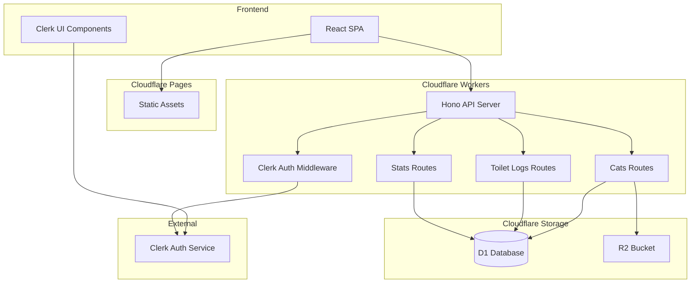
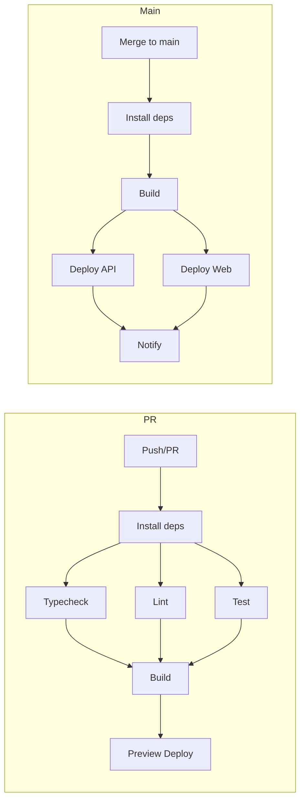
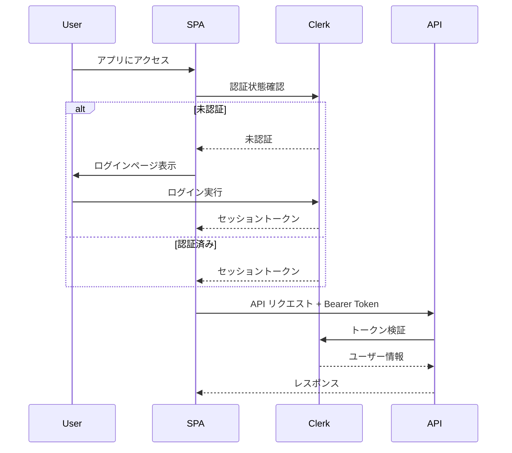
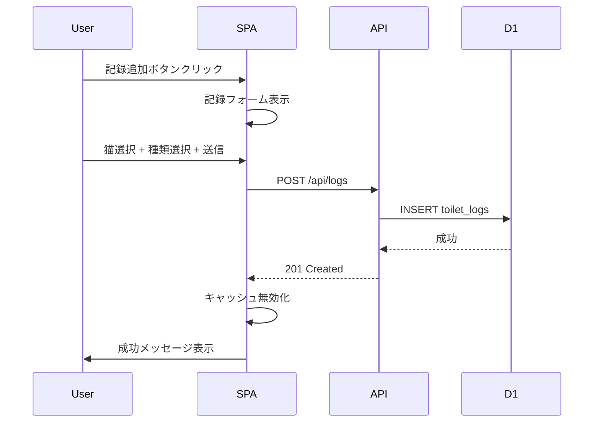
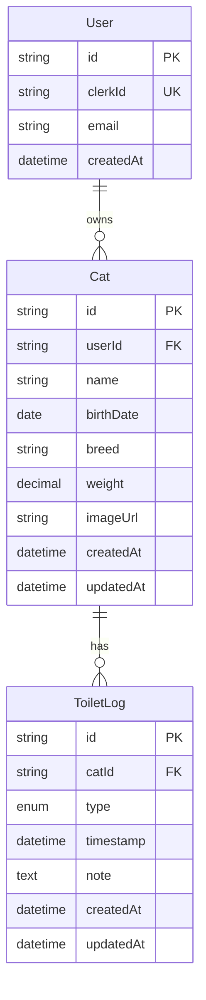

# Technical Design Document

## Overview

**Purpose**: NekoLog は飼い猫のトイレ利用状況を記録・可視化し、飼い主が猫の健康状態を把握できるようにする Web アプリケーションです。

**Users**: 猫の飼い主が日常的にトイレ記録を登録し、ダッシュボードで統計を確認するために使用します。

**Impact**: Cloudflare エコシステム上にサーバーレスアプリケーションとして新規構築します。

### Goals
- 猫のトイレ記録を素早く登録できる UI
- 日別・週別・月別の統計をダッシュボードで可視化
- 複数の猫を管理可能
- 招待制認証による安全なアクセス制御
- Hono RPC による型安全なスキーマ駆動 API
- pnpm + Turborepo によるモノレポ構成
- GitHub Actions による自動 CI/CD

### Non-Goals
- ユーザー自己登録機能（管理者による事前登録のみ）
- ご飯・カロリー計算機能（将来対応）
- 健康アラート・通知機能（将来対応）
- PWA / オフライン同期（初期スコープ外）

## Architecture

### Architecture Pattern & Boundary Map



**Architecture Integration**:
- **Selected Pattern**: レイヤードモノリス（単一 Workers 内で機能別ルート分割）
- **Domain Boundaries**: 認証・猫管理・トイレ記録・統計の4ドメイン
- **New Components Rationale**: グリーンフィールド開発のため全コンポーネントが新規
- **Steering Compliance**: Cloudflare サーバーレス、TypeScript ファースト、スキーマ駆動

### Technology Stack

| Layer | Choice / Version | Role in Feature | Notes |
|-------|------------------|-----------------|-------|
| Package Manager | pnpm v9 | 依存関係管理 | workspaces でモノレポ |
| Build Orchestration | Turborepo v2 | ビルド・タスク実行 | キャッシュで高速化 |
| Frontend | React 18 + Vite + TypeScript | SPA UI | TanStack Query でデータ取得 |
| API Client | hc (Hono Client) | 型安全 API 呼び出し | AppType から型推論 |
| State Management | TanStack Query v5 | サーバー状態管理 | キャッシュ・再取得自動化 |
| UI Components | Tailwind CSS + shadcn/ui | スタイリング | モバイルファースト |
| Charts | Recharts | 統計グラフ表示 | 軽量チャートライブラリ |
| Backend | Hono v4 + TypeScript | API サーバー | Workers 最適化 |
| Validation | Zod | スキーマ検証 | RPC 型生成に使用 |
| ORM | Drizzle ORM | DB クエリ | D1 ネイティブ対応 |
| Database | Cloudflare D1 | データ永続化 | SQLite 互換 |
| Object Storage | Cloudflare R2 | 画像保存 | 猫の写真用 |
| Authentication | Clerk | 認証・認可 | @hono/clerk-auth |
| Hosting | Cloudflare Pages | 静的ホスティング | SPA 配信 |
| Runtime | Cloudflare Workers | API ホスティング | エッジ実行 |
| CI/CD | GitHub Actions | 自動テスト・デプロイ | wrangler-action v3 |

### Monorepo Structure

```
nekolog/
├── .github/
│   └── workflows/
│       ├── ci.yml              # PR 時のテスト・lint
│       └── deploy.yml          # main マージ時のデプロイ
├── apps/
│   ├── web/                    # React SPA (Cloudflare Pages)
│   │   ├── src/
│   │   ├── package.json
│   │   ├── vite.config.ts
│   │   └── tsconfig.json
│   └── api/                    # Hono API (Cloudflare Workers)
│       ├── src/
│       ├── package.json
│       ├── wrangler.toml
│       └── tsconfig.json
├── packages/
│   └── shared/                 # 共有型・スキーマ
│       ├── src/
│       │   ├── types.ts        # 共通型定義
│       │   └── schemas.ts      # Zod スキーマ
│       ├── package.json
│       └── tsconfig.json
├── package.json                # ルート package.json
├── pnpm-workspace.yaml         # pnpm workspaces 設定
├── turbo.json                  # Turborepo 設定
└── tsconfig.base.json          # 共通 TypeScript 設定
```

### Workspace Configuration

```yaml
# pnpm-workspace.yaml
packages:
  - "apps/*"
  - "packages/*"
```

```json
// turbo.json
{
  "$schema": "https://turbo.build/schema.json",
  "tasks": {
    "build": {
      "dependsOn": ["^build"],
      "outputs": ["dist/**", ".next/**"]
    },
    "dev": {
      "cache": false,
      "persistent": true
    },
    "lint": {
      "dependsOn": ["^build"]
    },
    "test": {
      "dependsOn": ["^build"]
    },
    "typecheck": {
      "dependsOn": ["^build"]
    },
    "deploy": {
      "dependsOn": ["build", "test", "typecheck"]
    }
  }
}
```

### Package Dependencies

```json
// apps/web/package.json (抜粋)
{
  "name": "@nekolog/web",
  "dependencies": {
    "@nekolog/shared": "workspace:*"
  }
}

// apps/api/package.json (抜粋)
{
  "name": "@nekolog/api",
  "dependencies": {
    "@nekolog/shared": "workspace:*"
  }
}
```

## CI/CD Pipeline

### GitHub Actions Workflow



### CI Workflow (ci.yml)

```yaml
name: CI

on:
  pull_request:
    branches: [main]

jobs:
  ci:
    runs-on: ubuntu-latest
    steps:
      - uses: actions/checkout@v4

      - uses: pnpm/action-setup@v4
        with:
          version: 9

      - uses: actions/setup-node@v4
        with:
          node-version: "20"
          cache: "pnpm"

      - run: pnpm install --frozen-lockfile

      - run: pnpm turbo typecheck lint test

      - run: pnpm turbo build

      # Preview deploy for PR
      - name: Deploy API Preview
        uses: cloudflare/wrangler-action@v3
        with:
          apiToken: ${{ secrets.CLOUDFLARE_API_TOKEN }}
          accountId: ${{ secrets.CLOUDFLARE_ACCOUNT_ID }}
          workingDirectory: apps/api
          command: deploy --env preview

      - name: Deploy Web Preview
        uses: cloudflare/wrangler-action@v3
        with:
          apiToken: ${{ secrets.CLOUDFLARE_API_TOKEN }}
          accountId: ${{ secrets.CLOUDFLARE_ACCOUNT_ID }}
          workingDirectory: apps/web
          command: pages deploy dist --project-name=nekolog-preview
```

### Deploy Workflow (deploy.yml)

```yaml
name: Deploy

on:
  push:
    branches: [main]

jobs:
  deploy:
    runs-on: ubuntu-latest
    steps:
      - uses: actions/checkout@v4

      - uses: pnpm/action-setup@v4
        with:
          version: 9

      - uses: actions/setup-node@v4
        with:
          node-version: "20"
          cache: "pnpm"

      - run: pnpm install --frozen-lockfile

      - run: pnpm turbo build

      - name: Deploy API
        uses: cloudflare/wrangler-action@v3
        with:
          apiToken: ${{ secrets.CLOUDFLARE_API_TOKEN }}
          accountId: ${{ secrets.CLOUDFLARE_ACCOUNT_ID }}
          workingDirectory: apps/api
          command: deploy

      - name: Deploy Web
        uses: cloudflare/wrangler-action@v3
        with:
          apiToken: ${{ secrets.CLOUDFLARE_API_TOKEN }}
          accountId: ${{ secrets.CLOUDFLARE_ACCOUNT_ID }}
          workingDirectory: apps/web
          command: pages deploy dist --project-name=nekolog
```

### Required Secrets

| Secret | Description |
|--------|-------------|
| `CLOUDFLARE_API_TOKEN` | Cloudflare API トークン（Workers/Pages 編集権限） |
| `CLOUDFLARE_ACCOUNT_ID` | Cloudflare アカウント ID |
| `CLERK_SECRET_KEY` | Clerk シークレットキー（本番用） |

## System Flows

### 認証フロー



### トイレ記録登録フロー



## Requirements Traceability

| Requirement | Summary | Components | Interfaces | Flows |
|-------------|---------|------------|------------|-------|
| 1.1 | ログインページ表示 | LoginPage, ClerkProvider | - | 認証フロー |
| 1.2 | 認証とリダイレクト | AuthMiddleware, ClerkMiddleware | - | 認証フロー |
| 1.3 | 無効認証エラー | LoginPage | - | 認証フロー |
| 1.4 | 未認証リダイレクト | ProtectedRoute | - | 認証フロー |
| 1.5 | ログアウト | Header, ClerkProvider | - | - |
| 1.6 | ユーザー作成なし | - | - | Clerk Dashboard で管理 |
| 2.1 | 猫登録 | CatForm, CatsAPI | CatsService | - |
| 2.2 | 名前必須 | CatForm, catsSchema | CatsService | - |
| 2.3 | 追加情報登録 | CatForm, CatImageUpload | CatsService, R2 | - |
| 2.4 | 猫一覧表示 | CatList | CatsService | - |
| 2.5 | 猫情報編集 | CatEditForm | CatsService | - |
| 2.6 | 猫削除 | CatDeleteDialog | CatsService | カスケード削除 |
| 3.1 | トイレ記録追加 | LogForm | LogsService | 記録登録フロー |
| 3.2 | 種類記録 | LogForm, logsSchema | LogsService | - |
| 3.3 | 日時設定 | LogForm | LogsService | - |
| 3.4 | メモ記録 | LogForm | LogsService | - |
| 3.5 | 成功メッセージ | Toast | - | - |
| 3.6 | 記録編集 | LogEditForm | LogsService | - |
| 3.7 | 記録削除 | LogDeleteDialog | LogsService | - |
| 4.1 | 本日サマリー | DashboardSummary | StatsService | - |
| 4.2 | 期間別表示 | StatsChart | StatsService | - |
| 4.3 | 種類別表示 | StatsChart | StatsService | - |
| 4.4 | 期間選択 | PeriodSelector | StatsService | - |
| 4.5 | 猫別詳細 | CatStats | StatsService | - |
| 4.6 | グラフ表示 | StatsChart | - | Recharts |
| 5.1 | 履歴一覧 | HistoryList | LogsService | - |
| 5.2-5.4 | フィルタリング | HistoryFilters | LogsService | - |
| 5.5 | ページネーション | Pagination | LogsService | - |
| 6.1-6.2 | レスポンシブ | 全UIコンポーネント | - | Tailwind |
| 6.3 | 素早い記録UI | QuickLogButton | LogsService | - |
| 6.4 | オフライン通知 | OfflineIndicator | - | - |

## Components and Interfaces

### Summary

| Component | Domain/Layer | Intent | Req Coverage | Key Dependencies | Contracts |
|-----------|--------------|--------|--------------|------------------|-----------|
| HonoApp | Backend/Core | API エントリーポイント | All | Hono, ClerkMiddleware (P0) | API |
| CatsRoutes | Backend/Routes | 猫管理 API | 2.1-2.6 | DrizzleORM, R2 (P0) | API |
| LogsRoutes | Backend/Routes | トイレ記録 API | 3.1-3.7, 5.1-5.5 | DrizzleORM (P0) | API |
| StatsRoutes | Backend/Routes | 統計 API | 4.1-4.6 | DrizzleORM (P0) | API |
| ClerkMiddleware | Backend/Auth | 認証検証 | 1.1-1.5 | @hono/clerk-auth (P0) | Service |
| App | Frontend/Core | SPA エントリーポイント | All | React, TanStack Query (P0) | - |
| DashboardPage | Frontend/Page | ダッシュボード | 4.1-4.6 | StatsService (P0) | - |
| CatsPage | Frontend/Page | 猫管理ページ | 2.1-2.6 | CatsService (P0) | - |
| HistoryPage | Frontend/Page | 履歴ページ | 5.1-5.5 | LogsService (P0) | - |
| LogForm | Frontend/Component | 記録登録フォーム | 3.1-3.4 | hc client (P0) | - |

### Backend / API Layer

#### HonoApp

| Field | Detail |
|-------|--------|
| Intent | API サーバーのエントリーポイント、ルーティング統合 |
| Requirements | All |

**Responsibilities & Constraints**
- すべての API ルートを統合
- CORS 設定
- エラーハンドリングの統一

**Dependencies**
- Inbound: Cloudflare Workers runtime — リクエスト受付 (P0)
- Outbound: CatsRoutes, LogsRoutes, StatsRoutes — 機能別ルート (P0)
- External: Clerk — 認証検証 (P0)

**Contracts**: API [x]

##### API Contract

```typescript
// エントリーポイント型定義
import { Hono } from 'hono';

type Bindings = {
  DB: D1Database;
  BUCKET: R2Bucket;
  CLERK_SECRET_KEY: string;
  CLERK_PUBLISHABLE_KEY: string;
};

const app = new Hono<{ Bindings: Bindings }>();

// ルート統合
app.route('/api/cats', catsRoutes);
app.route('/api/logs', logsRoutes);
app.route('/api/stats', statsRoutes);

export type AppType = typeof app;
export default app;
```

#### CatsRoutes

| Field | Detail |
|-------|--------|
| Intent | 猫の CRUD 操作を提供する API ルート |
| Requirements | 2.1, 2.2, 2.3, 2.4, 2.5, 2.6 |

**Contracts**: API [x]

##### API Contract

| Method | Endpoint | Request | Response | Errors |
|--------|----------|---------|----------|--------|
| GET | /api/cats | - | Cat[] | 401 |
| GET | /api/cats/:id | - | Cat | 401, 404 |
| POST | /api/cats | CreateCatInput | Cat | 400, 401 |
| PUT | /api/cats/:id | UpdateCatInput | Cat | 400, 401, 404 |
| DELETE | /api/cats/:id | - | { success: true } | 401, 404 |
| POST | /api/cats/:id/image | FormData (file) | { imageUrl: string } | 400, 401, 404 |

##### Service Interface

```typescript
// Zod スキーマ定義
import { z } from 'zod';

export const createCatSchema = z.object({
  name: z.string().min(1).max(50),
  birthDate: z.string().datetime().optional(),
  breed: z.string().max(50).optional(),
  weight: z.number().positive().optional(),
});

export const updateCatSchema = createCatSchema.partial();

export type CreateCatInput = z.infer<typeof createCatSchema>;
export type UpdateCatInput = z.infer<typeof updateCatSchema>;

export interface Cat {
  id: string;
  userId: string;
  name: string;
  birthDate: string | null;
  breed: string | null;
  weight: number | null;
  imageUrl: string | null;
  createdAt: string;
  updatedAt: string;
}
```

**Implementation Notes**
- 画像アップロードは multipart/form-data で受け取り R2 に保存
- 猫削除時は関連する toilet_logs も CASCADE 削除
- userId は Clerk ミドルウェアから取得

#### LogsRoutes

| Field | Detail |
|-------|--------|
| Intent | トイレ記録の CRUD 操作と履歴取得を提供 |
| Requirements | 3.1-3.7, 5.1-5.5 |

**Contracts**: API [x]

##### API Contract

| Method | Endpoint | Request | Response | Errors |
|--------|----------|---------|----------|--------|
| GET | /api/logs | ?catId, ?type, ?from, ?to, ?page, ?limit | PaginatedLogs | 401 |
| GET | /api/logs/:id | - | ToiletLog | 401, 404 |
| POST | /api/logs | CreateLogInput | ToiletLog | 400, 401 |
| PUT | /api/logs/:id | UpdateLogInput | ToiletLog | 400, 401, 404 |
| DELETE | /api/logs/:id | - | { success: true } | 401, 404 |

##### Service Interface

```typescript
import { z } from 'zod';

export const toiletTypeSchema = z.enum(['urine', 'feces']);

export const createLogSchema = z.object({
  catId: z.string().uuid(),
  type: toiletTypeSchema,
  timestamp: z.string().datetime(),
  note: z.string().max(500).optional(),
});

export const updateLogSchema = createLogSchema.partial();

export const logsQuerySchema = z.object({
  catId: z.string().uuid().optional(),
  type: toiletTypeSchema.optional(),
  from: z.string().datetime().optional(),
  to: z.string().datetime().optional(),
  page: z.coerce.number().int().positive().default(1),
  limit: z.coerce.number().int().positive().max(100).default(20),
});

export type ToiletType = z.infer<typeof toiletTypeSchema>;
export type CreateLogInput = z.infer<typeof createLogSchema>;
export type UpdateLogInput = z.infer<typeof updateLogSchema>;

export interface ToiletLog {
  id: string;
  catId: string;
  catName: string;
  type: ToiletType;
  timestamp: string;
  note: string | null;
  createdAt: string;
  updatedAt: string;
}

export interface PaginatedLogs {
  data: ToiletLog[];
  total: number;
  page: number;
  limit: number;
  totalPages: number;
}
```

#### StatsRoutes

| Field | Detail |
|-------|--------|
| Intent | ダッシュボード用統計データを集計して提供 |
| Requirements | 4.1-4.6 |

**Contracts**: API [x]

##### API Contract

| Method | Endpoint | Request | Response | Errors |
|--------|----------|---------|----------|--------|
| GET | /api/stats/summary | - | DailySummary | 401 |
| GET | /api/stats/chart | ?catId, ?period, ?from, ?to | ChartData | 401 |

##### Service Interface

```typescript
import { z } from 'zod';

export const periodSchema = z.enum(['daily', 'weekly', 'monthly']);

export const statsQuerySchema = z.object({
  catId: z.string().uuid().optional(),
  period: periodSchema.default('daily'),
  from: z.string().datetime().optional(),
  to: z.string().datetime().optional(),
});

export interface CatSummary {
  catId: string;
  catName: string;
  urineCount: number;
  fecesCount: number;
  totalCount: number;
}

export interface DailySummary {
  date: string;
  cats: CatSummary[];
  totalUrineCount: number;
  totalFecesCount: number;
  totalCount: number;
}

export interface ChartDataPoint {
  date: string;
  urineCount: number;
  fecesCount: number;
  totalCount: number;
}

export interface ChartData {
  catId: string | null;
  catName: string | null;
  period: 'daily' | 'weekly' | 'monthly';
  data: ChartDataPoint[];
}
```

### Frontend / Pages Layer

#### DashboardPage

| Field | Detail |
|-------|--------|
| Intent | 本日のサマリーと統計グラフを表示するメインページ |
| Requirements | 4.1-4.6 |

**Implementation Notes**
- TanStack Query で `/api/stats/summary` と `/api/stats/chart` を並列取得
- 期間セレクターで daily/weekly/monthly を切り替え
- Recharts で折れ線グラフ表示

#### LogForm

| Field | Detail |
|-------|--------|
| Intent | トイレ記録を素早く登録するためのフォーム |
| Requirements | 3.1-3.5 |

**Implementation Notes**
- 猫選択はドロップダウン（事前に猫一覧を取得）
- 種類は urine/feces のトグルボタン
- 日時は現在時刻をデフォルト、DateTimePicker で変更可能
- 送信後は楽観的更新でキャッシュ反映
- vercel-react-best-practices の `rerender-functional-setstate` に従い安定したコールバックを使用

## Data Models

### Domain Model



**Business Rules & Invariants**:
- User は Clerk で認証された userId を持つ
- Cat は必ず User に属する
- ToiletLog は必ず Cat に属する
- Cat 削除時は関連する ToiletLog も削除

### Physical Data Model (D1/SQLite)

```sql
-- Users table (Clerk ユーザー情報のローカルキャッシュ)
CREATE TABLE users (
  id TEXT PRIMARY KEY,
  clerk_id TEXT UNIQUE NOT NULL,
  email TEXT NOT NULL,
  created_at TEXT NOT NULL DEFAULT (datetime('now'))
);

-- Cats table
CREATE TABLE cats (
  id TEXT PRIMARY KEY,
  user_id TEXT NOT NULL REFERENCES users(id) ON DELETE CASCADE,
  name TEXT NOT NULL,
  birth_date TEXT,
  breed TEXT,
  weight REAL,
  image_url TEXT,
  created_at TEXT NOT NULL DEFAULT (datetime('now')),
  updated_at TEXT NOT NULL DEFAULT (datetime('now'))
);

CREATE INDEX idx_cats_user_id ON cats(user_id);

-- Toilet logs table
CREATE TABLE toilet_logs (
  id TEXT PRIMARY KEY,
  cat_id TEXT NOT NULL REFERENCES cats(id) ON DELETE CASCADE,
  type TEXT NOT NULL CHECK (type IN ('urine', 'feces')),
  timestamp TEXT NOT NULL,
  note TEXT,
  created_at TEXT NOT NULL DEFAULT (datetime('now')),
  updated_at TEXT NOT NULL DEFAULT (datetime('now'))
);

CREATE INDEX idx_toilet_logs_cat_id ON toilet_logs(cat_id);
CREATE INDEX idx_toilet_logs_timestamp ON toilet_logs(timestamp);
CREATE INDEX idx_toilet_logs_cat_timestamp ON toilet_logs(cat_id, timestamp);
```

### Drizzle Schema

```typescript
import { sqliteTable, text, real, index } from 'drizzle-orm/sqlite-core';
import { sql } from 'drizzle-orm';

export const users = sqliteTable('users', {
  id: text('id').primaryKey(),
  clerkId: text('clerk_id').unique().notNull(),
  email: text('email').notNull(),
  createdAt: text('created_at').notNull().default(sql`(datetime('now'))`),
});

export const cats = sqliteTable('cats', {
  id: text('id').primaryKey(),
  userId: text('user_id').notNull().references(() => users.id, { onDelete: 'cascade' }),
  name: text('name').notNull(),
  birthDate: text('birth_date'),
  breed: text('breed'),
  weight: real('weight'),
  imageUrl: text('image_url'),
  createdAt: text('created_at').notNull().default(sql`(datetime('now'))`),
  updatedAt: text('updated_at').notNull().default(sql`(datetime('now'))`),
}, (table) => ({
  userIdIdx: index('idx_cats_user_id').on(table.userId),
}));

export const toiletLogs = sqliteTable('toilet_logs', {
  id: text('id').primaryKey(),
  catId: text('cat_id').notNull().references(() => cats.id, { onDelete: 'cascade' }),
  type: text('type', { enum: ['urine', 'feces'] }).notNull(),
  timestamp: text('timestamp').notNull(),
  note: text('note'),
  createdAt: text('created_at').notNull().default(sql`(datetime('now'))`),
  updatedAt: text('updated_at').notNull().default(sql`(datetime('now'))`),
}, (table) => ({
  catIdIdx: index('idx_toilet_logs_cat_id').on(table.catId),
  timestampIdx: index('idx_toilet_logs_timestamp').on(table.timestamp),
  catTimestampIdx: index('idx_toilet_logs_cat_timestamp').on(table.catId, table.timestamp),
}));
```

## Error Handling

### Error Categories and Responses

**User Errors (4xx)**:
- 400 Bad Request — Zod バリデーションエラー、フィールドごとのエラーメッセージを返却
- 401 Unauthorized — Clerk トークン無効、ログインページへリダイレクト案内
- 404 Not Found — リソース不存在、該当リソースの案内

**System Errors (5xx)**:
- 500 Internal Server Error — D1/R2 エラー、汎用エラーメッセージ
- 503 Service Unavailable — 外部サービス（Clerk）障害

### Error Response Format

```typescript
interface ApiError {
  error: {
    code: string;
    message: string;
    details?: Record<string, string[]>; // バリデーションエラー用
  };
}

// 例: バリデーションエラー
{
  "error": {
    "code": "VALIDATION_ERROR",
    "message": "入力内容に誤りがあります",
    "details": {
      "name": ["名前は必須です"],
      "weight": ["体重は正の数で入力してください"]
    }
  }
}
```

## Testing Strategy

### Unit Tests
- Zod スキーマのバリデーションロジック
- 統計集計関数（日別・週別・月別の計算）
- 日付フォーマット・パース関数
- Drizzle クエリビルダー
- **実行**: `pnpm turbo test --filter=@nekolog/shared`

### Integration Tests
- 認証フロー（Clerk ミドルウェア動作確認）
- CRUD 操作の DB 反映
- R2 画像アップロード・取得
- カスケード削除の動作
- **実行**: `pnpm turbo test --filter=@nekolog/api`

### E2E Tests
- ログイン → ダッシュボード表示
- 猫登録 → 一覧表示
- トイレ記録登録 → 統計更新
- 履歴フィルタリング・ページネーション
- **ツール**: Playwright
- **実行**: `pnpm turbo test:e2e --filter=@nekolog/web`

### CI Pipeline での実行
- PR 時: `pnpm turbo typecheck lint test` で全テスト実行
- Turborepo のキャッシュにより、変更のあったパッケージのみ再テスト

## Security Considerations

### Authentication & Authorization
- すべての API エンドポイントは Clerk 認証必須
- userId ベースのデータアクセス制御（他ユーザーのデータ参照不可）
- ユーザー作成は Clerk Dashboard からのみ（招待制）

### Data Protection
- R2 の画像は認証済みユーザーのみアクセス可能
- API レスポンスに他ユーザーの情報を含めない
- SQL インジェクション対策（Drizzle ORM のパラメータ化クエリ）

## Performance & Scalability

### Target Metrics
- API レスポンス: < 200ms（P95）
- 初期ロード: < 2s（モバイル 4G）
- ダッシュボード描画: < 500ms

### Optimization Strategies
- TanStack Query によるキャッシュ活用（staleTime: 30秒）
- 統計クエリのインデックス最適化
- 画像の遅延読み込み
- vercel-react-best-practices の `bundle-dynamic-imports` に従い Recharts を動的インポート
